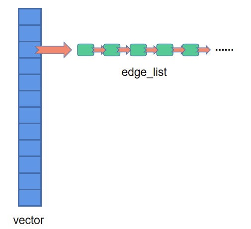
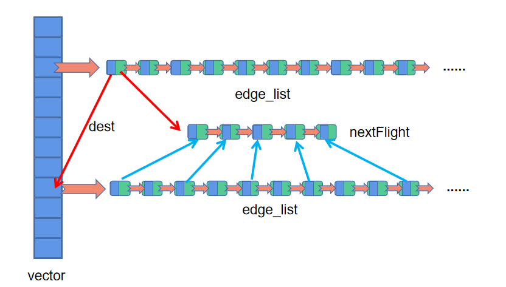

# Lab 3 : Airline 实验报告

本实验全部代码发布在该 [GitHub网页](https://github.com/CentrifugalAI/DataStructure-2022/tree/main/lab3airline)

---

## 程序架构


继承此前实验结构组织风格，本实验中仍然采用以下步骤构建程序：

- 实现基础的数据结构
- 继承和封装基础数据结构，结合题意定义新的数据结构类型
- 基于新的数据结构类型实现相关题目的操作

该实验的基础数据结构是：`GraphList` 和 `GraphMatrix` ，分别表示**邻接表**和**邻接矩阵**，邻接矩阵依据数据结构课程课件实现，邻接表则自行实现，并提供了和邻接矩阵**完全一致的外部接口**。

定义机场数据类型 `Airport` ，该数据类型利用**多继承**，同时继承了 `GraphList` 和 `GraphMatrix` ，以便同时完成题目中要求的利用邻接矩阵和邻接表实现的所有功能。

另外，该程序实现了程序与用户交互的接口 `Execute` 类和读取数据文件的功能模块 `ReadData`，分别位于 `execute.hpp` 和 `readData.hpp` 文件中。


---

## 第一部分：不考虑时序关系

### 2.1 : 基于邻接表实现的图遍历

本程序关于邻接矩阵的实现方式可以参见下图：



以广度优先搜索为例，基于邻接表实现图遍历可以概括为以下步骤：

- 从起点出发，遍历起点的 `edge_list` ，将每个节点放入一个队列 `Q` 中
- 每次取出 `Q` 的首节点进行访问，然后同样遍历其 `edge_list`，将其每个节点放入队列 `Q` 中
- 重复以上两个步骤直到队列 `Q` 为空

讨论所有顶点，覆盖图中的所有连通域，即实现 `BFS`

### 2.2 : 基于邻接矩阵实现的连通性判断

基于邻接矩阵实现的图连通性判断思路如下：

构建一个 `n * n` 大小、`bool` 类型的 `arrivable` 数组，这个数组的每个元素的值都被初始化为 `false` 。

对于图上的每个点 `startVertex` 进行一轮限制深度的 `BFS`，遍历到节点 `curVertex` 时 ， `arrivable[startVertex][curVertex]` 值设置为 `true`，未遍历到点对应的的 `arrivable[startVertex][curVertex]` 属性则默认为 `false`

输出 `arrivable` 数组则返回答案。

---

## 第二部分：考虑时序关系

### 现有数据结构分析

对于 `2.3` 之后的题目，要求考虑时序关系进行分析，因此需要使用合适的数据结构。我们分析一下已用的两种数据结构在相关问题上的支持：

#### 邻接矩阵造成的信息丢失

邻接矩阵的核心结构是一个 `n * n` 的矩阵，每个矩阵表示一条边，因此，当两个航空站间存在不少于一条航线时，后读入的航线（边）会覆盖原先读入的航线，造成信息的丢失

#### 邻接表对于“双点多边”特殊图结构的支持

而当采用邻接表来模拟机场建图的过程时，每个点都有一个链表作为以该顶点为出发点的航班列表，每次添加边时只需要在这个列表的末端进行追加即可。因此即使一个点出发到达另一个点的航班有多趟，在插入边也不会产生冲突覆盖的现象。

#### `nextFlights` 实现思路：“无效边”的删除

为了后续迪杰斯特拉算法的高效进行，仅仅依靠邻接表这样的数据结构无法实现本题的需求：

当航班之间具有时序关系时，传统的邻接表数据结构面临的瓶颈表现在，当我们需要确认一趟航班所能承接的下一趟航班时，需要遍历下一个点的所有边，并逐一地进行比较，确认这个点能否到达。这种方式不仅照成时间复杂度的提高，还使得整个程序的构造逻辑变得更加抽象。

因此，这里为每个边 `FlightInfo` 增加了 `nextFlights` 属性，该变量是一个指针列表，初始化函数 `initNextFlight` 无视了了终点出发的航班中不符合时间关系的航班，将符合时间关系的航班放入列表 `nextFlights` 中。



初始化 `nextFlights` 属性的 `initNextFlight` 函数仅需要如下几行简单的代码，它们实现了非常重要的功能，在**后续“以边为主”的算法思路**中起到重要的角色：

```C++
void Airports::initNextFlight()
{
    for (auto edge_list : this->E)
        for (auto edge : edge_list)     // 讨论每一个航班站（顶点）的每一趟航班（边）
            for (auto next_edge : E[edge->data->destPortID])     // 每一条边讨论终点起飞的所有航班（边）
                if (edge->data->arrivalTime <= next_edge->data->departTime)  // 如果上一趟航班起飞时间比上一趟终点出发的下一趟航班抵达时间晚
                    edge->data->nextFlights.push_back(next_edge->data);   // 认为该航班可以作为下一趟航班，并载入前一趟航班的 nextFlight
}
```

并且，这是一个预处理功能的函数，在程序的声明周期中仅需要调用一次，因此虽然使用了三重循环来实现，但是**我们并不认为这步操作非常“奢侈”**。

> 事实上经过时间复杂度分析，该函数的时间复杂度不会超过 $O(e^2)$

### 2.3 机场间航线数目

可以使用**广度优先搜索算法/限制深度的深度优先搜索**算法解决。

如下图所示，我们根据 `nextFlights` 属性，很容易求出一趟航班后的下一趟航班。我们只要考察起点的边和这些边的 `nextFlight` 属性。即可完整地考虑任意两个机场之间的航线数目。核心算法代码如下：

```C++
vector<int> arrivable;
for (auto edge : E[src_post.port_id])
{
    arrivable.push_back(edge->dest);
    if (transfer_time >= 1)
        for (auto flight : edge->data->nextFlights)
            arrivable.push_back(flight->destPortID);
}
```
---

### 2.4 求解

#### “以边为主”的算法思路

该题应该采用**沿边搜索**，即**搜索的目标不再是节点，而是边**（以边为主）。

借助每个边具有的 `nextFlights` 属性，**确定边的后继边即确定航班的后续航班**。

这样，每个航班被抽象为一个对象，我们操作的最小单元不再是传统图结构中的点，而是**边**

事实上，这种做法也等价于将每趟航班视为一个点——**点与点之间不再是地点上的关联关系，而是时间上的承接关系**

#### 迪杰斯特拉算法设计

基于上述思路，设计本题的迪杰斯特拉算法，算法的目标自然是在于找到飞行时间最短的路径。可以采用如下步骤构造算法：

> 本题对优先级的规约是：一个节点的优先级指的是在**抵达该航班的起点时所花费的时间**，**这个语义规约使得后面提到的 `lastFlight` 属性仅有唯一的一个**，使得回溯过程大为简化。

- 将起点周围的所有**边**加入一个优先级队列中
- 每次从优先级队列中选出**优先级最低**的**边**，遍历这个边的 `nextFlights` 列表，更新 `nextFlights` 列表中下一趟航班的优先级，如果优先级被更新，则再次加入优先级队列中。
  
> 每个边维护一个 `lastFlight` 指针，用于记录**边优先级的更新者**，起点的 `lastFlight` 指针设置为哨兵
 
- 重复上步操作，**直到优先级队列为空**
- 遍历从终点出发的航班，**找到优先级最低的航班**。从该航班的 `lastFlight` 进行回溯，回溯到哨兵，终止回溯，输出结果。

上述思路可以兑现为代码如下：

```C++
while (!unadoptEle.empty())
{
    FlightEle bestFlightEle = unadoptEle.top();     // 贪心：最优边，采用并放入已采取队列中
    unadoptEle.pop();
    isAdopted[bestFlightEle.ID] = true;
    // 优先级更新   
    FlightInfo* best_flight = (*flights)[bestFlightEle.ID];
    for (auto next_flight : best_flight->nextFlights)
    {
        if (isAdopted[next_flight->flight_id])
            continue;
        if (next_flight->priority > best_flight->priority + best_flight->arrivalTime.toNum() - best_flight->lastFlight->arrivalTime.toNum())
        {
            next_flight->priority = best_flight->priority + best_flight->arrivalTime.toNum() - best_flight->lastFlight->arrivalTime.toNum();
            next_flight->lastFlight = best_flight;
            unadoptEle.push(FlightEle(next_flight->flight_id, next_flight->priority, next_flight->guard));      // 更新后的 next_flight 加入未采用队列
        }
    }
}
```

后续的题目将不再对迪杰斯特拉算法进行详细分析，因为本题已经设计了迪杰斯特拉算法的模板思路，后续题的不同**仅在于剪枝方法和优先级设定不同**。

#### `priority queue` 陷阱

本题中对于优先队列 `priotrity_queue` 的使用方法为：


由于**优先级队列不支持循秩访问**，

这是一个利用指针作为节点构建二叉堆时值得一提的 `BUG` ，`BUG` 触发的原理如下图所示

### 2.5 约束条件下求解中转次数不超过 K 的一条航线

本题同样利用迪杰斯特拉算法，首先在优先级更新方法上作些许调整：

将每趟航班的优先级定义为：**到这趟航班的起点之前进行中转的次数之和**。

当发现中转次数最少的路径的中转次数仍然大于 `K` ，输出 `-1` 即可

另外，本题还另有**起飞时段、降落时段和机型要求**约束条件——在我们的算法设计中，对这些约束条件的处理方式为：

如果从优先级队列取出的航班不满足要求时，则直接跳过——**不再更新这个航班的下一趟航班的优先级**，利用这种方法实现**逻辑上的剪枝**

因此可以得到，算法的核心代码如下：

```C++
while (!unadoptEle.empty())
{
    // 算法正式启动：
    FlightInfo* bestFlight = new FlightInfo(unadoptEle.top());     // 贪心：最优边，采用并放入已采取队列中
    unadoptEle.pop();
    isAdopted[bestFlight->flight_id] = true;
    // 优先级更新   
    for (auto next_flight : bestFlight->nextFlights)
    {
        if (isAdopted[next_flight->flight_id] ||
            next_flight->departTime < srcTime_lb || next_flight->departTime > srcTime_ub ||
            next_flight->arrivalTime < destTime_lb || next_flight->arrivalTime > destTime_ub ||
            next_flight->plane_model != p_model)  // 如果一个航班已经被考虑过了则跳过
            continue;
        // 下一航班（next_flight）抵达起点时使用的停机次数 > 上一航班（bestFlight）抵达时使用的停机次数
        if (next_flight->priority > bestFlight->priority + 1)
        {
            next_flight->priority = bestFlight->priority + 1;
            next_flight->lastFlight = bestFlight;
            unadoptEle.push(*next_flight); 
        }
    }
} 
```

### 2.6 约束条件下求解航费不超过 K 的一条航线

本题从思路、算法架构上都与 [$2.5$ ](#25-约束条件下求解中转次数不超过-k-的一条航线) 相当一致，将优先级修改为航费即可，不再赘述。

代码请直接参见实验报告开头给出的程序源码。

### 2.7 双变量约束条件下求解航线

问题在于本题有**两个变量约束条件**：中转时间和中转次数。

本题的解决策略同样采用迪杰斯特拉算法进行处理：

- 将中转次数作为**约束条件**，将中转时间作为**目标变量**
- 同 $2.5$ 中的方法进行约束条件下的迪杰斯特拉算法，求出**中转次数符合条件**的中转时间最短的航班。
- 如果该时间最短的航班中转时间都大于规定值，则说明目标航线不存在

上述思路看上去并不很难，但是事实上我们能证明它是正确的：

- 所有不符合中转次数约束条件的航线都会被“**中途淘汰**”，因此能够被终点出发航班的 `lastFlight` 追溯到的点都是符合中转次数约束条件的航线
- 这些航线同时又是经过迪杰斯特拉算法选择的——因此**如果它们不能符合中转时间约束条件，将会不存在其它中转时间约束条件的航线**

上述思路可以兑现为以下代码：

```C++
while (!unadoptEle.empty())
{
    // 算法正式启动：
    FlightInfo* bestFlight = new FlightInfo(unadoptEle.top());     // 贪心：最优边，采用并放入已采取队列中
    unadoptEle.pop();
    isAdopted[bestFlight->flight_id] = true;
    // 优先级更新   
    for (auto next_flight : bestFlight->nextFlights)
    {
        if (bestFlight->guard >= max_transfer_time)
            break;
        if (isAdopted[next_flight->flight_id])  // 如果一个航班已经被考虑过了则跳过或者中转次数已经达到警戒值
            continue;
        // 下一航班（next_flight）抵达起点时使用的停机次数 > 上一航班（bestFlight）抵达时使用的停机次数
        if (next_flight->priority > bestFlight->priority + next_flight->departTime.toNum() - bestFlight->arrivalTime.toNum())
        {
            next_flight->priority = bestFlight->priority + next_flight->departTime.toNum() - bestFlight->arrivalTime.toNum();
            next_flight->guard = bestFlight->guard + 1;
            next_flight->lastFlight = bestFlight;
            unadoptEle.push(*next_flight);      // 更新后的 next_flight 加入未采用队列
        }
    }
}   // 可以得到起点到任何一个点的最短时间
```

### 2.8 约束条件下求解最短航费路径

事实上，本题算法思路和上题基本一致：

- 将中转时间作为**约束条件**，将航费作为**目标变量**
- 同 $2.5$ 中的方法进行约束条件下的迪杰斯特拉算法，求出**中转时间符合条件**的航费最少的航班。

该算法可以兑现为如下代码：

```C++
while (!unadoptEle.empty())
{
    // 算法正式启动：
    FlightInfo* bestFlight = new FlightInfo(unadoptEle.top());     // 贪心：最优边，采用并放入已采取队列中
    unadoptEle.pop();
    isAdopted[bestFlight->flight_id] = true;
    // 优先级更新   
    for (auto next_flight : bestFlight->nextFlights)
    {
        if (bestFlight->guard >= max_time)      // 中转时间超过要求
            break;
        if (isAdopted[next_flight->flight_id])  // 如果一个航班已经被考虑过了则跳过或者中转次数已经达到警戒值
            continue;
        // 下一航班（next_flight）抵达起点时使用的费用 > 上一航班（bestFlight）抵达时使用的费用
        if (next_flight->priority > bestFlight->priority + bestFlight->fare)
        {
            next_flight->priority = bestFlight->priority + bestFlight->fare;
            next_flight->guard = bestFlight->guard + next_flight->departTime.toNum() - bestFlight->arrivalTime.toNum();
            next_flight->lastFlight = bestFlight;
            unadoptEle.push(*next_flight);      // 更新后的 next_flight 加入未采用队列
        }
    }
}   // 可以得到起点到任何一个点的最短时间
```
